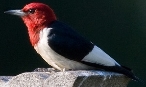
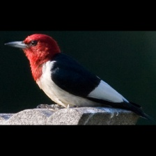
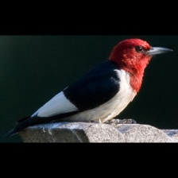
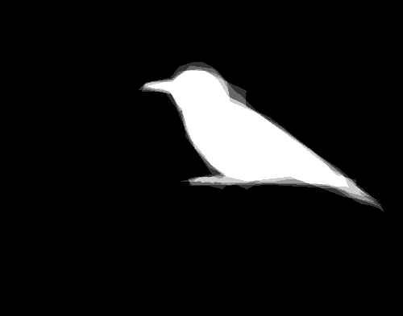
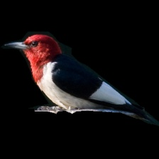

---
## Bird Classification with CNNs

###### Red-Tailed Hawk (📷 : [@CubanRalph](https://www.reddit.com/user/CubanRalph))
---

### Project Description

As a capstone project for the DSI I chose to create a bird classifier, given my fascination with image recongnition and an amateur interest in birds. Like most people I interact with, my free time is limited. And as a serial hobbiest I am wary of becoming a full fledged "birder". With not enough time to really invest in becoming a bird expert, I aim to create a solution which will let me quickly identify a bird from a picture.

While Googling I found the [CUB200 dataset](http://www.vision.caltech.edu/visipedia/CUB-200-2011.html), a robust resource with approx 40-60 images for 200 classes of birds. There are a number of papers published using this dataset and I decided this would be a good data set to start with.

When I started this project I did not truly understand how difficult it would be. I quickly understood my task at hand has been appropriately dubbed __Fine-grained Object Classification__, which aims to identify categories that are both visually and semantically very similar within a general category, i.e. species of birds. "Unfortunately, it is an extremely difficult task because objects from similar subordinate categories may have marginal visual difference that is even difficult for humans to recognize. In addition, objects within the same subordinate category may present large appearance variations due to changes of scales, viewpoints, complex backgrounds and occlusions." ([source](https://arxiv.org/pdf/1606.08572.pdf))

### Data & preprocessing

The [CUB200 Birds Dataset](http://www.vision.caltech.edu/visipedia/CUB-200-2011.html) is made available via the Caltech Vision team. I was fortunate in that this dataset is clean, organized, and comes with some goodies.

There was a little bit of preprocessing to be done and I immediately dove in building things from scratch. The dataset provided __bounding box__ data for every image to take advantage of. I used this to crop the images:

Original image                     |  Cropped image
:-------------------------:|:-------------------------:
  | 

In order to ensure every cropped image was fed into the CNN with the same dimension the cropped image needed to be resized. However inorder to maintain the original aspect ratio margins were added to the top & bottom, or left & right, the scaled to size:

Cropped image              |  Squared & resized image
:-------------------------:|:-------------------------:
  | 

Two data augmentation techniques I tried was mirroring the images (axis=1) which double the number of datapoints the model trains on.

__Mirrored image__

The data set also includes a corresponding __segmentation__ image for every image. I experimented with masking the data  with the help of the segmentation images. This improved my results however I decided to not incorporate segmentation because in the real world my input images would not include segmentation.

Provided segmentation              |  Masked input
:-------------------------:|:-------------------------:
  | 

After experimenting with the CUB200 dataset and acheiving mediocre results I decided to explore using more data / images.

I was lucky to find the [NABirds](http://dl.allaboutbirds.org/nabirds) dataset, which contains over 48,000 images for 404 classes of species. The NABirds dataset is also very well organized and comes with provided bounding box data.

My final model was trained using the bounding box cropping and squaring techniques described above.

### Approach

Given the dataset consists of 200 classes my initial ambitous goal is to create a final solution which can accurately predict any of the 200 classes given an unseen image. I quickly realized with this number of classes a high accuracy rate would be difficult.

I decided to start small, and build from there.

Starting with only two classes of birds, I was able to get a simple CNN up and running on my local machine using Keras and Theano. 100% test accuracy was acheived in no time using two very distinct species:

 
> _trained on 90 images, tested on 30 images_

Next to make it more difficult, I choose two similar species... 87.99% test accuracy:

 
> _trained on 90 images, tested on 30 images_

I then decided to establish a benchmark for 10 classes, and try a number of different methods to optimize the CNN and improve performance.
> _trained on 598 images, tested on 299 images_

* Test accuracy: 0.42 — baseline
* Test accuracy: 0.56 — w/ flipped images in training
* Test accuracy: 0.24 — w/ masked images in training
* Test accuracy: 0.48 — w/ masked images in training & test

[best 10 class with CNN architecture built from scratch]
* Test accuracy:  0.65 — w/ flipped images & ImageDataGenerator
* Top 5 accuracy: 0.95
* Top 3 accuracy: 0.88

In order to see where I stood overall with the entire dataset all 200 classes, the next milestone was to run the full dataset with 200 classes through my initial model.
>_trained on 8841 images, tested on 2947 images_

[baseline with scratch built CNN]
* Test accuracy:  0.13
* Top 5 accuracy: 0.56
* Top 3 accuracy: 0.33

At this point I pivoted to using a pretrained network, the VGG16. This drastically improved my results. Pretrained networks provide a substantial lift because the network weights have already been optimized using __ImageNet__.
* The goal of the ImageNet classification challenge is to train a model that can correctly classify an input image into 1,000 separate object categories. Models are trained on approximately 1.2 million training images with another 50,000 images for validation and 100,000 images for testing.

What this means is that the pretrained VGG16 network can already detect differences in colors and contours instead of starting from scratch and trying to optimize the network weights.

>_trained on 8841 images, tested on 2947 images_

* Test accuracy:  0.68
* Top 5 accuracy: 0.90
* Top 3 accuracy: 0.86

At this point it was time to add more data. I decided to stay with my original task of classifying 200 classes although the class labels (bird species) themselves were changed. Utilizing the NABirds dataset my training data went from 8841 images to 23569 images. This yeiled the best results to date.

>_trained on 23569 images, validated on 4000 images, tested on 3856 images_

* Test accuracy:  0.81
* Top 5 accuracy: 0.96
* Top 3 accuracy: 0.93

#### Still need to try...
* Incorporate meta data, see how much improvement can be made
* Advanced architectures
* More image data!!

### Best solution
...

### Results

....
